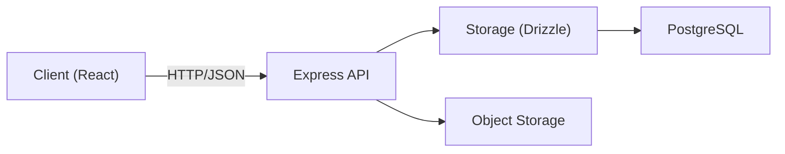

## Architecture Notes
The system is a single TypeScript codebase split into a React client and an Express server, sharing domain schemas through `shared/schema.ts`. It prioritizes rapid feature delivery for commerce and services while keeping domain contracts consistent between API and UI.

## System Architecture Overview
This is a modular monolith deployed as one web server process. Requests flow from the browser to Express routes, which call the storage layer (Drizzle ORM) and return JSON to the client. In development, Vite is wired into the same server process for a unified dev experience.

## Architectural Layers
- **Models**: domain schemas and validation (`shared/`)
- **Controllers**: API routes and client data access (`server/`, `client/src/lib/`)
- **Utils**: shared helpers (`client/src/lib/`)
- **Components**: UI and pages (`client/src/components/`, `client/src/pages/`)

> See [`codebase-map.json`](./codebase-map.json) for complete symbol counts and dependency graphs.

## Detected Design Patterns
| Pattern | Confidence | Locations | Description |
| --- | --- | --- | --- |
| Service Layer | 85% | [`server/storage.ts`](../../server/storage.ts#L18), [`client/src/lib/api.ts`](../../client/src/lib/api.ts#L1) | Encapsulates data access and HTTP client operations behind stable APIs. |
| Repository Pattern | 70% | [`server/storage.ts`](../../server/storage.ts#L18) | Centralizes persistence and makes data operations consistent. |
| Shared Schema | 80% | [`shared/schema.ts`](../../shared/schema.ts#L1) | Drizzle + Zod schemas define a single source of truth. |

## Entry Points
- Server bootstrap: [`server/index.ts`](../../server/index.ts#L1)
- Client bootstrap: [`client/src/main.tsx`](../../client/src/main.tsx#L1)
- Database/migrations: [`db/index.ts`](../../db/index.ts#L1)
- Build pipeline: [`script/build.ts`](../../script/build.ts#L1)

## Public API
| Symbol | Type | Location |
| --- | --- | --- |
| `DatabaseStorage` | class | [`server/storage.ts`](../../server/storage.ts#L85) |
| `IStorage` | interface | [`server/storage.ts`](../../server/storage.ts#L18) |
| `registerRoutes` | function | [`server/routes.ts`](../../server/routes.ts#L59) |
| `CheckoutData` | type | [`shared/schema.ts`](../../shared/schema.ts#L186) |
| `CartProvider` | function | [`client/src/lib/cart.tsx`](../../client/src/lib/cart.tsx#L24) |
| `apiRequest` | function | [`client/src/lib/queryClient.ts`](../../client/src/lib/queryClient.ts#L10) |

## External Service Dependencies
- **Object storage**: uploads and access control via `server/replit_integrations/object_storage/`.
- **Resend email**: transactional notifications in [`server/email.ts`](../../server/email.ts#L1).
- **WhatsApp**: checkout and appointment messaging via deep links from the client.

## Key Decisions & Trade-offs
Shared schema definitions reduce contract drift, but require care when evolving migrations. Sessions are server-side (express-session) rather than JWT to simplify auth across admin and customer flows.

## Diagrams

## Risks & Constraints
The system assumes a single server process, so horizontal scaling requires session store changes. Migration auto-run relies on `DATABASE_URL`, which must be set for any environment.

## Top Directories Snapshot
- `client/` (85 files)
- `server/` (10 files)
- `shared/` (1 file)
- `db/` (2 files)
- `migrations/` (3 files)
- `attached_assets/` (17 files)

## Related Resources
- [`project-overview.md`](./project-overview.md)
- [`data-flow.md`](./data-flow.md)
- [`codebase-map.json`](./codebase-map.json)
