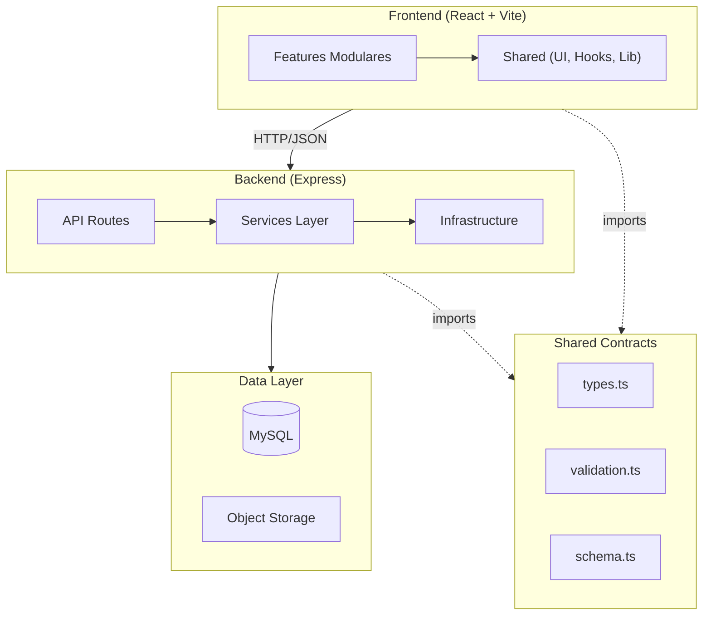

## Architecture Notes

O sistema é um monolito modular TypeScript com separação clara entre **frontend**, **backend** e **código compartilhado**. A arquitetura prioriza:

- **Modularidade**: Features organizadas por domínio de negócio
- **Contratos compartilhados**: Tipos e validações consistentes entre camadas
- **Separação de responsabilidades**: Rotas, serviços e infraestrutura bem definidos

## System Architecture Overview

Este é um monolito modular deployado como um único processo web. O frontend React comunica via HTTP/JSON com a API Express, que utiliza uma camada de serviços e o padrão Repository para acesso a dados via Drizzle ORM.



## Architectural Layers

### Frontend (`frontend/`)
- **App**: Bootstrap da aplicação (App.tsx, main.tsx)
- **Features**: Módulos por domínio (admin, products, cart, auth, etc)
- **Shared**: Componentes UI, hooks e utilitários reutilizáveis
- **Pages**: Páginas genéricas (404, etc)

### Backend (`backend/`)
- **API Routes**: Endpoints HTTP organizados por domínio
- **Services**: Lógica de negócio isolada
- **Infrastructure**: DB, storage, email, payments

### Shared (`shared/`)
- **Contracts**: Tipos e validações frontend-safe
- **Schema**: Definições Drizzle (backend only)

## Design Patterns

| Pattern | Localização | Descrição |
| --- | --- | --- |
| **Feature-Based Architecture** | `frontend/features/` | Frontend organizado por domínios de negócio |
| **Service Layer** | `backend/services/` | Lógica de negócio isolada das rotas |
| **Repository Pattern** | `backend/infrastructure/storage.ts` | Abstração de acesso a dados |
| **Shared Contracts** | `shared/contracts/` | Tipos e validações compartilhados |
| **Context Pattern** | `frontend/features/cart/lib/cart.tsx` | Estado global do carrinho |

## Entry Points

| Camada | Entry Point | Descrição |
| --- | --- | --- |
| Frontend | `frontend/app/main.tsx` | Bootstrap React |
| Backend | `backend/api/index.ts` | Setup Express + middlewares |
| Database | `backend/infrastructure/db/index.ts` | Conexão + migrações |
| Build | `scripts/build.mjs` | Build pipeline |

## Public API

### Backend Services
| Symbol | Type | Location |
| --- | --- | --- |
| `DatabaseStorage` | class | `backend/infrastructure/storage.ts` |
| `registerAllRoutes` | function | `backend/api/routes/index.ts` |
| `AuthService` | class | `backend/services/auth.service.ts` |
| `CheckoutService` | class | `backend/services/checkout.service.ts` |

### Frontend Exports
| Symbol | Type | Location |
| --- | --- | --- |
| `CartProvider` | component | `frontend/features/cart/lib/cart.tsx` |
| `apiRequest` | function | `frontend/shared/lib/queryClient.ts` |
| `queryClient` | instance | `frontend/shared/lib/queryClient.ts` |

### Shared Contracts
| Symbol | Type | Location |
| --- | --- | --- |
| `CheckoutData` | type | `shared/contracts/types.ts` |
| `checkoutSchema` | zod schema | `shared/contracts/validation.ts` |

## External Service Dependencies

- **MySQL**: Banco de dados relacional via Drizzle ORM
- **Object Storage**: Upload de imagens e arquivos
- **Resend**: Envio de emails transacionais (`backend/infrastructure/email/`)
- **Stripe**: Processamento de pagamentos (`backend/infrastructure/payments/`)
- **WhatsApp**: Checkout via deep links (client-side)

## Key Decisions & Trade-offs

1. **Monolito Modular vs Microservices**: Escolhemos monolito para simplicidade de deploy e desenvolvimento, mas com estrutura modular que permite futura separação.

2. **Feature-Based vs Layer-Based**: Frontend organizado por features (domínios) ao invés de camadas (components/, pages/, hooks/) para melhor coesão e manutenibilidade.

3. **Shared Contracts**: Tipos e validações compartilhados reduzem drift entre frontend e backend, mas requerem cuidado ao evoluir schemas.

4. **Sessions vs JWT**: Sessions server-side (express-session) simplificam auth entre admin e clientes, mas limitam escalabilidade horizontal.

5. **Drizzle ORM**: Escolhido por type-safety e performance, com migrações SQL explícitas.

## Module Boundaries

```
┌─────────────────────────────────────────────────────────────────┐
│                         FRONTEND                                 │
│  ┌─────────────────────────────────────────────────────────┐    │
│  │ features/admin    │ features/products │ features/cart   │    │
│  │ features/auth     │ features/account  │ features/home   │    │
│  │ features/checkout │ features/scheduling                 │    │
│  └─────────────────────────────────────────────────────────┘    │
│  ┌─────────────────────────────────────────────────────────┐    │
│  │                    shared/ (UI, Hooks, Lib)              │    │
│  └─────────────────────────────────────────────────────────┘    │
└─────────────────────────────────────────────────────────────────┘
                              │
                    HTTP/JSON (api client)
                              │
┌─────────────────────────────────────────────────────────────────┐
│                          BACKEND                                 │
│  ┌─────────────────────────────────────────────────────────┐    │
│  │                    api/routes/                           │    │
│  │  products │ orders │ auth │ customers │ appointments    │    │
│  └─────────────────────────────────────────────────────────┘    │
│  ┌─────────────────────────────────────────────────────────┐    │
│  │                    services/                             │    │
│  │  auth.service │ checkout.service │ appointment.service  │    │
│  └─────────────────────────────────────────────────────────┘    │
│  ┌─────────────────────────────────────────────────────────┐    │
│  │                    infrastructure/                       │    │
│  │  storage │ db │ email │ payments                        │    │
│  └─────────────────────────────────────────────────────────┘    │
└─────────────────────────────────────────────────────────────────┘
                              │
┌─────────────────────────────────────────────────────────────────┐
│                    SHARED CONTRACTS                              │
│  contracts/types.ts │ contracts/validation.ts │ schema.ts       │
└─────────────────────────────────────────────────────────────────┘
```

## Risks & Constraints

1. **Single Process**: O sistema assume um único processo, escalabilidade horizontal requer session store externo (Redis).

2. **Migration Auto-run**: Migrações executam automaticamente na inicialização, requer `DATABASE_URL` configurado.

3. **Shared Schema Evolution**: Alterações no schema requerem coordenação entre frontend e backend.

## Top Directories Snapshot

- `frontend/` (~99 files) - Código do cliente React
- `backend/` (~25 files) - Código do servidor Express
- `shared/` (~4 files) - Contratos compartilhados
- `scripts/` (~6 files) - Scripts de build/dev
- `migrations/` (~3 files) - Migrações SQL
- `attached_assets/` (~17 files) - Assets estáticos

## Related Resources

- [`project-overview.md`](./project-overview.md)
- [`project-structure.md`](./project-structure.md)
- [`data-flow.md`](./data-flow.md)
