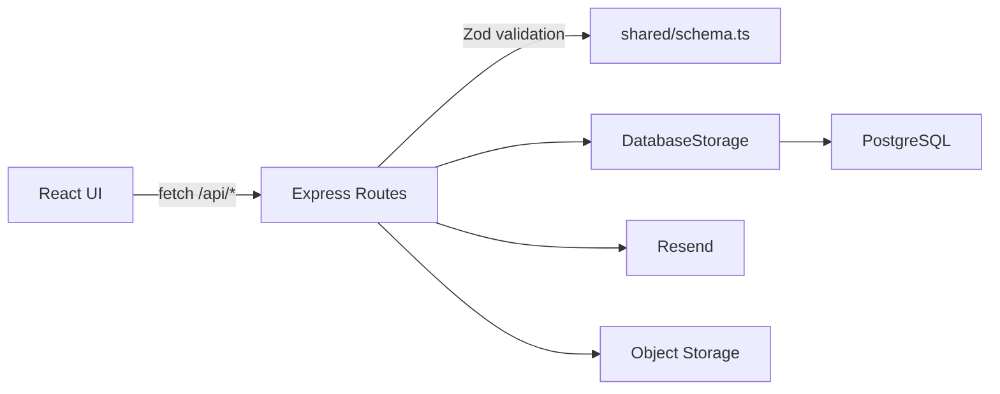

## Data Flow & Integrations
User actions in the React client call the API layer in `client/src/lib/api.ts`, which issues HTTP requests to Express routes. Routes validate input (Zod schemas from `shared/schema.ts`), execute storage operations through `DatabaseStorage`, and return JSON responses. External integrations (object storage and email) are invoked from the server for uploads and notifications.

## Module Dependencies
- **client/** -> `client/src/lib/api.ts` -> `/api/*` routes
- **server/** -> `shared/schema.ts` for validation and types
- **server/** -> `db/index.ts` (Drizzle + Postgres)
- **server/** -> `server/replit_integrations/object_storage/`
- **server/** -> `server/email.ts` (Resend)

## Service Layer
- `DatabaseStorage` (`server/storage.ts`) handles persistence and aggregate queries.
- `ObjectStorageService` (`server/replit_integrations/object_storage/objectStorage.ts`) manages file uploads and access.

## High-level Flow
Client event -> API request -> Express route -> validation -> storage -> database -> response -> UI update.

## Internal Movement
All domain data is shared through `shared/schema.ts`, ensuring client and server agree on fields. Session state is kept server-side with `express-session`, and customer/admin identity is stored in session cookies.

## External Integrations
- **Object Storage**: Used for uploads in admin flows; ACL enforced in `objectAcl.ts`.
- **Resend Email**: Notifies admins about new customers and appointment changes.
- **WhatsApp**: Checkout and appointment summaries are generated as messages for deep links.

## Observability & Failure Modes
API responses are logged in `server/index.ts`, including timing. Common failures include validation errors (Zod) and database connectivity (`DATABASE_URL`), both of which return structured error JSON.
