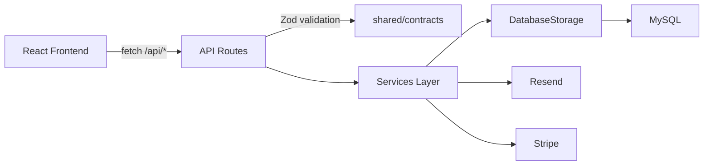

## Data Flow & Integrations

User actions in the React frontend call the API layer in `frontend/shared/lib/api.ts`, which issues HTTP requests to Express routes. Routes validate input (Zod schemas from `shared/contracts/`), execute service operations, and return JSON responses. External integrations (email and payments) are invoked from the server for notifications and transactions.

## Module Dependencies

```
frontend/features/*
    → frontend/shared/lib/api.ts
    → /api/* routes

backend/api/routes/*
    → backend/services/*
    → backend/infrastructure/storage.ts
    → shared/contracts/* (validation)
    → shared/schema.ts (Drizzle)

backend/infrastructure/*
    → MySQL (Drizzle ORM)
    → Resend (email)
    → Stripe (payments)
```

## Service Layer

- `DatabaseStorage` (`backend/infrastructure/storage.ts`) — Data access layer (Repository pattern)
- `AuthService` (`backend/services/auth.service.ts`) — Autenticação
- `CheckoutService` (`backend/services/checkout.service.ts`) — Processamento de pedidos
- `AppointmentService` (`backend/services/appointment.service.ts`) — Agendamentos

## High-level Flow

```
Frontend Event → API Request → Express Route → Validation → Service → Storage → Database → Response → UI Update
```



## Internal Movement

Domain types and validations are shared through `shared/contracts/`, ensuring frontend and backend agree on data shapes. Session state is kept server-side with `express-session`, and customer/admin identity is stored in session cookies.

## External Integrations

- **MySQL**: Banco de dados relacional via Drizzle ORM
- **Resend Email**: Notifica admins sobre novos clientes e agendamentos (`backend/infrastructure/email/`)
- **Stripe**: Processamento de pagamentos (`backend/infrastructure/payments/`)
- **WhatsApp**: Checkout e agendamentos via deep links (client-side)

## Observability & Failure Modes

API responses are logged in `backend/api/index.ts`, including timing. Common failures include:
- Validation errors (Zod) — Return structured error JSON
- Database connectivity (`DATABASE_URL`) — Graceful degradation with error logging
- Service errors — Caught and returned as appropriate HTTP status codes
